# DropX Database ER Diagram

Entity-relationship diagram for the schema in `migrate.sql`.

```mermaid
erDiagram
    branches ||--o{ hubs : has
    branches ||--o{ users : "home branch"

    roles ||--o{ user_roles : grants
    users ||--o{ user_roles : has
    roles ||--o{ role_permissions : grants
    users ||--o{ user_hubs : assigned
    hubs ||--o{ user_hubs : staff

    customers ||--o{ customer_addresses : has
    customers ||--o{ parcel_drafts : drafts
    customers ||--o{ parcels : sends
    customers ||--o{ parcels : receives
    customers ||--o{ settlements : settled
    customers ||--o{ support_tickets : opens
    customers ||--o{ notifications : notified

    hubs ||--o{ routes : "origin"
    hubs ||--o{ routes : "destination"
    routes ||--o{ route_stops : includes
    hubs ||--o{ route_stops : stop

    users ||--|| riders : "is rider"
    hubs ||--o{ riders : stationed
    riders ||--o{ rider_locations : tracks

    hubs ||--o{ parcels : "origin"
    hubs ||--o{ parcels : "destination"
    hubs ||--o{ parcels : "current"
    parcels ||--o{ parcel_items : contains
    parcels ||--o{ pickups : pickup
    parcels ||--o{ deliveries : delivery
    parcels ||--o{ parcel_events : events
    parcels ||--o{ payments : payments
    parcels ||--o{ transfer_parcels : moved_on
    parcels ||--o{ notifications : about
    parcels ||--o{ support_tickets : about

    users ||--o{ pickups : requested_by
    riders ||--o{ pickups : assigned
    riders ||--o{ deliveries : delivers
    hubs ||--o{ deliveries : from
    deliveries ||--o{ delivery_proofs : proves

    hubs ||--o{ transfers : "from"
    hubs ||--o{ transfers : "to"
    routes ||--o{ transfers : uses
    vehicles ||--o{ transfers : carries
    users ||--o{ transfers : drives
    transfers ||--o{ transfer_parcels : loads

    hubs ||--o{ parcel_events : at
    users ||--o{ parcel_events : by
    riders ||--o{ parcel_events : by
    users ||--o{ notifications : notified
    users ||--o{ support_tickets : assigned
    users ||--o{ audit_logs : acted

    branches {
        bigint id PK
        varchar code UK
        enum status
    }
    hubs {
        bigint id PK
        bigint branch_id FK
        varchar code UK
        enum type
    }
    users {
        bigint id PK
        bigint branch_id FK
        varchar email UK
    }
    roles {
        bigint id PK
        varchar name UK
    }
    user_roles {
        bigint user_id PK
        bigint role_id PK
    }
    role_permissions {
        bigint role_id PK
        varchar permission_key PK
    }
    user_hubs {
        bigint user_id PK
        bigint hub_id PK
    }
    customers {
        bigint id PK
        varchar code UK
        varchar phone UK
        varchar email UK
        varchar avatar_url
        enum status
    }
    customer_addresses {
        bigint id PK
        bigint customer_id FK
    }
    parcel_drafts {
        bigint id PK
        bigint customer_id UK
    }
    vehicles {
        bigint id PK
        varchar registration_number UK
    }
    routes {
        bigint id PK
        bigint origin_hub_id FK
        bigint destination_hub_id FK
        varchar code UK
    }
    route_stops {
        bigint id PK
        bigint route_id FK
        bigint hub_id FK
        int sequence_no
    }
    riders {
        bigint id PK
        bigint user_id UK
        bigint hub_id FK
        enum compensation_type
    }
    rider_locations {
        bigint id PK
        bigint rider_id FK
    }
    rider_applications {
        bigint id PK
        varchar phone
        enum vehicle_type
        enum status
    }
    parcels {
        bigint id PK
        varchar tracking_number UK
        bigint sender_customer_id FK
        bigint receiver_customer_id FK
        varchar receiver_name
        varchar receiver_phone
        varchar receiver_secondary_phone
        bigint origin_hub_id FK
        bigint destination_hub_id FK
        bigint current_hub_id FK
        enum status
    }
    parcel_items {
        bigint id PK
        bigint parcel_id FK
    }
    pickups {
        bigint id PK
        bigint parcel_id FK
        bigint assigned_rider_id FK
        enum status
    }
    transfers {
        bigint id PK
        varchar transfer_number UK
        bigint from_hub_id FK
        bigint to_hub_id FK
        bigint route_id FK
        bigint vehicle_id FK
        bigint driver_id FK
    }
    transfer_parcels {
        bigint transfer_id PK
        bigint parcel_id PK
    }
    deliveries {
        bigint id PK
        bigint parcel_id FK
        int attempt_no
        bigint hub_id FK
        bigint rider_id FK
        enum status
    }
    delivery_proofs {
        bigint id PK
        bigint delivery_id FK
        enum type
    }
    parcel_events {
        bigint id PK
        bigint parcel_id FK
        enum event_type
    }
    payments {
        bigint id PK
        bigint parcel_id FK
        enum type
        enum status
    }
    settlements {
        bigint id PK
        varchar code UK
        bigint customer_id FK
        enum status
    }
    notifications {
        bigint id PK
        bigint user_id FK
        bigint customer_id FK
        bigint parcel_id FK
    }
    support_tickets {
        bigint id PK
        bigint customer_id FK
        bigint parcel_id FK
        bigint assigned_to FK
    }
    audit_logs {
        bigint id PK
        bigint user_id FK
        varchar action
        varchar entity_type
    }
    sequences {
        varchar seq_name PK
        bigint next_value
    }
```

`riders.employee_code`, `customers.code` and `settlements.code` are server-assigned
sequential references (`RDR-0001`, `CUS-0001`, `SET-0001`). MySQL has no sequences, so each
one draws a number from the matching row of `sequences` with a single atomic
`INSERT ... ON DUPLICATE KEY UPDATE`. There is deliberately no foreign key: `sequences` is a
counter, not a fact about any row, and it is pinned above every code already in the table by
`migrate.sql` so a restored or hand-edited database cannot reissue a number.
